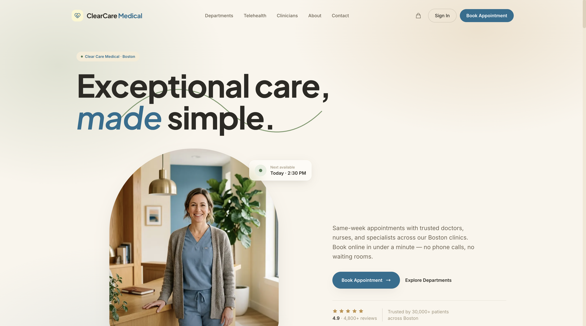
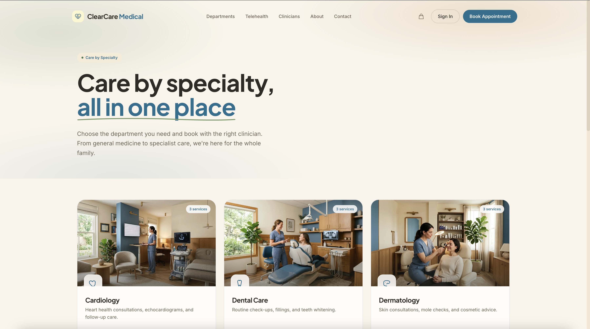

# Clear Care Medical — Next.js Clinic Booking Template

A production-ready booking website for medical clinics. Built with **Next.js 15**, **Tailwind CSS v4**, and the **Opencals Storefront SDK**.

**[View Live Demo →](https://template-clarity.vercel.app)**


Clean, clinical light palette (medical blue on soft white), department-first booking, and a full storefront — services, appointments, checkout, customer accounts — wired up out of the box. MIT licensed: clone it, rebrand it, ship it.

---

## Get Started in 3 Steps

### 1. Create an Opencals account

Sign up at **[app.opencals.com](https://app.opencals.com)** and create a **Dev Store**. When prompted for a dataset, choose the **Medical / Clear Care Medical** preset — this seeds your store with the clinic's departments, services, doctors, nurses, therapists, and locations so your template looks exactly like the demo.

### 2. Get your API key

Go to your **User Account Settings** in the Opencals dashboard and generate a **Storefront API key**. You'll need this to connect the template to your store.

### 3. Deploy to Vercel

[](https://vercel.com/new/clone?repository-url=https%3A%2F%2Fgithub.com%2Fletsopencals%2Ftemplate-clarity&env=OPENCALS_API_KEY,AUTH_SECRET&envDescription=API%20key%20from%20your%20Opencals%20dashboard%20and%20a%20random%20secret%20for%20auth&project-name=clarity&repository-name=clarity)

During deployment, Vercel will ask you to set environment variables:

| Variable | Value |
|----------|-------|
| `OPENCALS_API_KEY` | Your Storefront API key (starts with `sfk_`) |
| `AUTH_SECRET` | Any random string — used for session encryption |
| `NEXT_PUBLIC_STRIPE_PUBLISHABLE_KEY` | *(optional)* Stripe publishable key for payments |

That's it. Once deployed, you'll have the same fully functional booking site as the [live demo](https://template-clarity.vercel.app).

---

## The Storefront

A calm, editorial homepage, department-first browsing, and a multi-location "clinics" section — all driven by your Opencals data.






---

## What's Included

### Department-First Booking
Patients browse by specialty — General Medicine, Cardiology, Dermatology, Pediatrics, Physiotherapy, Dental, Nutrition, Mental Health, and Labs & Vaccinations — then pick a service and book. Each department is a product collection in your Opencals store.

### Online Booking
A single-page, card-stack booking flow inspired by native mobile apps: choose service → clinician → date → time → medical intake → confirm. Sticky bottom CTA on mobile, sticky summary rail on desktop.


### Medical Intake at Checkout
Custom checkout questions capture the reason for visit, insurance provider, and whether the patient is new — surfaced as a dedicated step in the booking flow and saved to the appointment.

### Group Sessions & Live Capacity
Group services (physiotherapy classes, nutrition workshops, group therapy) support multiple attendees. Available time slots show **"N left"** using live availability counts, and fill up when capacity is reached.

### Multi-Location Support
Global location selector, clinicians filtered by location, and per-location availability across all three clinics.

### Checkout with Stripe
Multi-step checkout with customer info, medical intake, and secure payment via Stripe Elements. Auto-login after checkout so the patient lands in their account with the new appointment.

### Customer Accounts
Sign in, view appointments, browse order history, manage profile, and reschedule or cancel appointments.


### Mobile-First Design
Fully responsive. The booking page in particular is designed mobile-first — the booking flow shown at the top of this README is the live template, not a mockup.

### SEO Ready
Per-page metadata, Open Graph cards, `MedicalClinic` structured data, robots.txt, and sitemap.xml — configured out of the box.

---

## Tech Stack

| Category | Technology |
|----------|-----------|
| Framework | Next.js 15 (App Router) |
| Styling | Tailwind CSS v4 |
| Animations | Framer Motion |
| Forms | react-hook-form + Zod |
| Payments | Stripe Elements |
| Auth | NextAuth.js v5 |
| Dates | moment-timezone |
| API | Opencals Storefront SDK (v0.3.8) |

---

## Local Development

```bash
git clone <repository-url>
cd clarity-clinic-template
npm install
cp .env.example .env
```

Edit `.env` with your values:

```
OPENCALS_API_KEY=sfk_your_key_here
AUTH_SECRET=change_me_to_a_random_string
```

```bash
npm run dev
```

Open [http://localhost:3000](http://localhost:3000).

---

## Customization

### Branding & Content

All clinic-specific copy is centralized in **`lib/site-config.ts`**:

- Clinic name, tagline, logo wordmark
- Homepage hero text, stats, story cards, testimonials
- About page story, clinicians, values
- Contact information (address, phone, email, hours)
- Footer links and social media

Edit this single file to rebrand the entire template.

### Theme Colors

Design tokens live in **`app/globals.css`** as Tailwind v4 `@theme` properties. Token names are
intentionally stable, so components keep working when you change the values:

```css
@theme {
  --color-bg: #F7FAFC;        /* page background */
  --color-surface: #FFFFFF;   /* cards / panels */
  --color-cream: #12303F;     /* primary ink (dark on light) */
  --color-copper: #005B8E;    /* medical-blue accent (also --color-gold) */
  --font-display: 'Plus Jakarta Sans', system-ui, sans-serif;
  --font-body: 'Inter', system-ui, sans-serif;
}
```

Tip: keep the accent aligned with your store's storefront primary color so the deployed site matches your Opencals settings.

### Imagery

Drop hero, gallery, clinician, and location images into `public/images/{hero,gallery,team,locations,services}/`. See **`public/images/PLACEHOLDERS.md`** for filenames and recommended dimensions. Service and clinician photos in the live booking flow come from your Opencals store, not this folder.

### Adding Pages

1. Create `app/your-page/page.tsx`
2. Add a `layout.tsx` with metadata
3. Add the link to `navLinks` in `components/layout/header.tsx`

---

## Project Structure

```
app/
  page.tsx                     # Homepage
  departments/page.tsx         # Department (specialty) overview
  departments/[slug]/page.tsx  # Services within a department
  services/page.tsx            # Flat list of every service
  booking/[slug]/page.tsx      # Card-stack booking page
  thank-you/page.tsx           # Post-checkout confirmation
  about/                       # About page
  contact/                     # Contact form + info
  account/                     # Customer dashboard
  auth/                        # Sign in, sign up, password reset
  api/                         # API routes proxy SDK calls server-side

components/
  layout/{header,footer}.tsx   # Site chrome
  home/                        # Hero, departments, services, locations, clinicians, gallery, testimonials
  booking/                     # Date picker, time slots, clinician/location selectors, summary
  checkout/                    # Multi-step form components
  cart/cart-drawer.tsx

contexts/                      # cart, location, timezone, settings
hooks/                         # use-api-request, use-form-submit, use-booking-flow, use-date-formatter
lib/                           # site-config, opencals (SDK), auth (NextAuth), schemas, format, utils
```

## Environment Variables

| Variable | Required | Description |
|----------|----------|-------------|
| `OPENCALS_API_KEY` | Yes | Storefront API key from your Opencals dashboard |
| `AUTH_SECRET` | Yes | Random string for NextAuth session encryption |
| `NEXT_PUBLIC_STRIPE_PUBLISHABLE_KEY` | No | Stripe publishable key for payment processing |
| `OPENCALS_API_URL` | No | Override API base URL (defaults to production) |
| `NEXT_PUBLIC_BASE_URL` | No | Public site URL (for sitemap) |

---

## Other Templates

Clear Care Medical is one of the open-source booking templates built on the Opencals Storefront SDK. Same backend, different design and vertical:

- **[Frisor](https://github.com/letsopencals/template-frisor)** — a modern barbershop template with a dark editorial palette. [Live demo](https://template-frisor-sage.vercel.app)
- **[HAAR](https://github.com/letsopencals/template-haar)** — a hair-salon booking template with a light, warm palette. [Live demo](https://template-haar.vercel.app)

See all templates and the Storefront API at **[opencals.com/developers](https://opencals.com/developers)**.

## License

MIT
